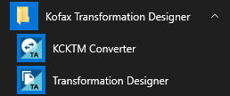

# KTM2KTA
Tips and Tools for migrating from KTM to KTA.

## Conversion
It is possible to import a KTM project into KTA Transformation Designer.  This creates a shared project that combines Classification with Extraction.  
It is recommended to use the [**KCKTM Converter**](https://docshield.kofax.com/KTA/en_US/7.11.0-h49vd5omev/help/KCKTM_Converter/MigrationTool/c_Welcome.html) that is installed along with **Transformation Designer**.  
  
This will create a separate **Classification Group** and **Extraction Group**.  Check the documentation for how it handles validation rules and field formatters - it does try to convert them to KTA versions if possible.  

It is recommened to use separate separate **Classification Group** and **Extraction Group** for processing documents. This enables you to have multiple Extraction Groups connected to the same Classificaiton Groups. This keeps your projects smaller and allows people to work in parallel. You no longer have monolithic extraction groups. However, if you have document classes that **inherit** from other classes then you should pack them into the same extraction group to benefit from inherited locators and scripts.

